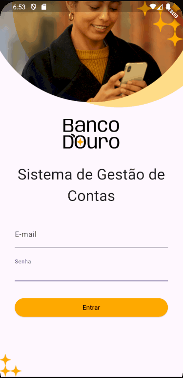

# Do Dart ao Flutter: criando seu primeiro aplicativo

O projeto Banco d'Ouro é um Sistema de Gestão de Contas para o banco de mesmo nome. O objetivo é permitir que uma pessoa colaboradora possa auxiliar as pessoas clientes a criarem e consultarem suas contas.

### Tópicos abordados no curso:

- Configurar o ambiente de desenvolvimento Flutter e criar seus primeiros projetos.
- Estrutura do Flutter e o papel dos Widgets na construção de interfaces.
- Principais widgets, como Column, Text, Scaffold e AppBar.
- Navegação entre telas e crie rotas nomeadas.
- Formulários com validação de dados e modais para captura e envio de informações.
- Dados assíncronos usando FutureBuilder e listas dinâmicas com ListView.
- Indicadores de carregamento e respostas automáticas.

Este curso é ideal para pessoas desenvolvedoras que já possuam base em Dart, e desejem progredir com seus conhecimentos para desenvolver apps com Flutter.

## 📑 Requisitos

- Conhecimentos básicos de Flutter e Dart;
- VS Code com plugins do Flutter e Dart instalados (recomendado para acompanhar este curso);
- É importante ter o Flutter na versão 3.24.6 ou superior, e o Dart na versão 3.5.3 ou superior;
- Você precisará configurar um "Classic Token" no GitHub permitindo o gerenciamento dos seus Gist e criar um arquivo `api_key.dart` dentro da pasta `services` contendo uma string `githubApiKey` com essa chave. Não esqueça de adicionar esse arquivo no `.gitignore`; 

## 🛠️ Abrir e rodar o projeto

Aqui vem um passo a passo para abrir e rodar o projeto.

- Baixe o projeto ou clone o repositório;
- Extraia o arquivo .zip se necessário;
- Abra a pasta com o VSCode;
- Não esqueça de adicionar sua chave de api do Gist;
- Abra o terminal e rode `flutter run` e escolha o "device" correto. Ou, tendo o arquivo `main.dart` aberto, simplesmente pressione "F5" para começar a depuração com o VSCode;